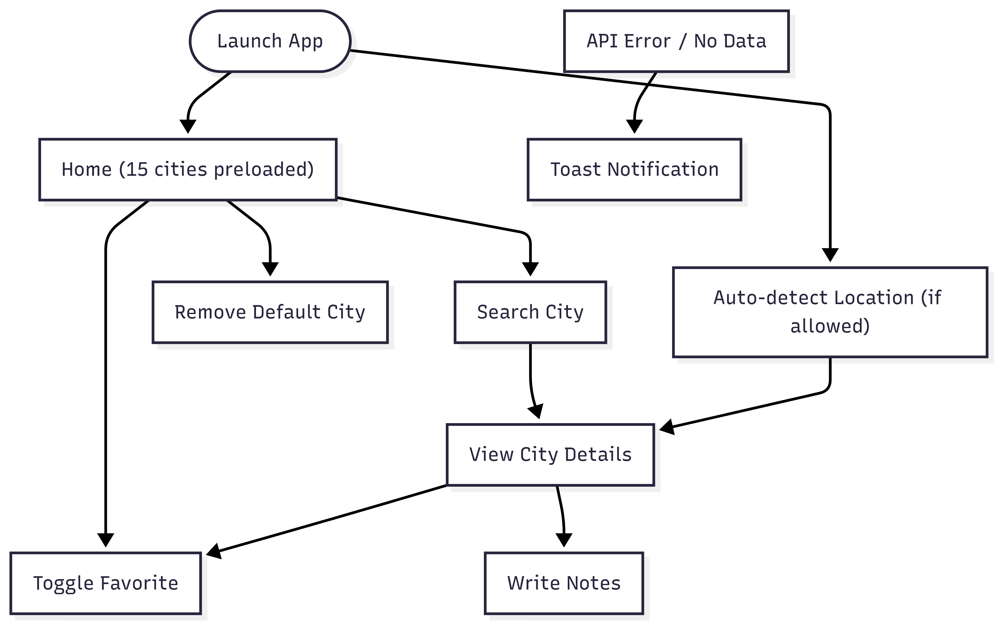
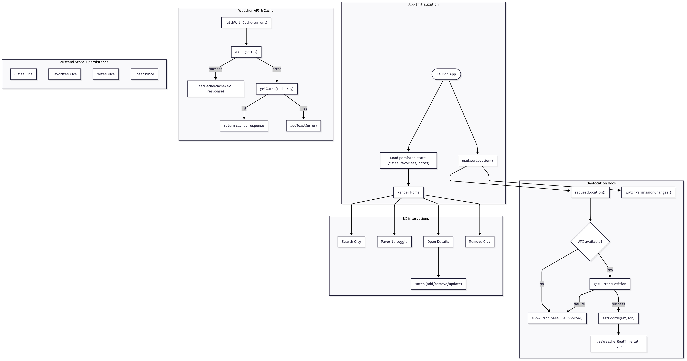
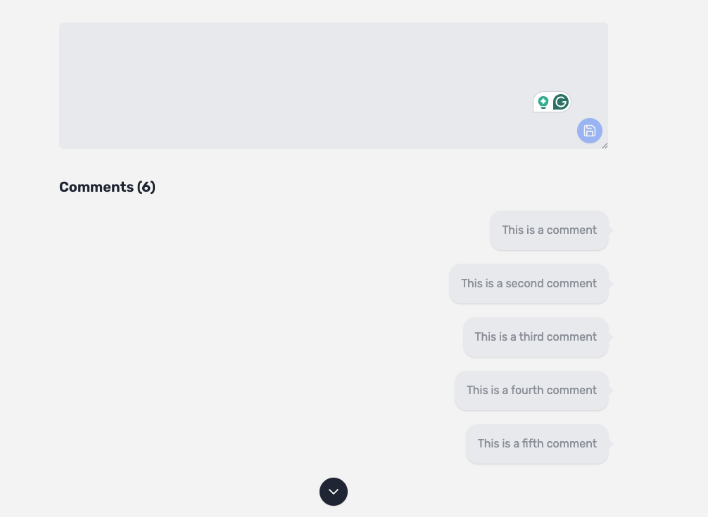

# 🌍 Weather Notes App

A **React + TypeScript** project that delivers a complete weather-tracking and note-taking experience — from **real-time API integration** to **offline persistence** and **stateful UI management**.

This application was built as part of the **Software Design Engineer** role evaluation at **Elite Software Automation (ESA)**, highlighting skills in **architectural design**, **state management**, **data transformation**, **error handling**, and **comprehensive testing**.

---

## ✨ Features

- ✅ **Live Weather Data**: integrates with an external weather API, normalized into strongly typed models.
- ✅ **Preloaded Cities**: includes the 15 largest cities worldwide, alphabetically sorted by default.
- ✅ **Dynamic City Management**: users can add and remove cities seamlessly.
- ✅ **Favorites**: cities can be marked as favorites, persisted, and sorted alphabetically.
- ✅ **Detailed City Pages**: weather details combined with a personal note-taking interface.
- ✅ **Search**: quickly locate and explore new cities.
- ✅ **Offline Persistence**: both raw API responses and application state are stored in `localforage`.
- ✅ **Geolocation Support**: detect the user’s current location and show relevant weather.
- ✅ **Modern UI**: built with React, TailwindCSS, and reusable components.
- ✅ **Testing**: thorough unit and component coverage with Vitest + React Testing Library.

---

## 🏗️ Architecture & Design

### State Management

The application uses **zustand** for predictable and modular state slices:

- **CitiesSlice**: handles available cities, including defaults and dynamic updates.
- **FavoritesSlice**: manages favorite cities and ensures persistence.
- **NotesSlice**: stores city-specific notes with timestamps.
- **ToastsSlice**: provides transient notifications for user feedback.

Each slice is:

- Self-contained
- Fully typed with TypeScript
- Persisted via `localforage`

---

## 🔄 Flows

The application can be understood from two perspectives: **User Flow** (experience-level) and **System Flow** (engineering-level).

### 1. User Flow



### 2. System Flow



---

## 📂 Key Modules

- **`/store/slices`** → modular state (cities, favorites, notes, toasts).
- **`/api/weather`** → weather API integration + caching + transformers.
- **`/components`** → reusable UI: `Cities`, `SearchBar`, `CommentSection`, `ToastContainer`.
- **`/pages`** → route-level views: `HomePage`, `WeatherPage`.
- **`/utils/storage.ts`** → helper functions for `getCache` and `setCache`.

---

## 🧪 Testing

Testing is powered by **Vitest** and **React Testing Library**.

To run all suites:

```bash
npm install
npm test
```

Coverage includes:

- **Unit Tests** for helpers, transformers, and zustand slices.
- **Component Tests** for rendering correctness and user interactions.

---

## 🖼️ Screenshots

### Home Page


### Weather Details Page


### Notes



### Weather Info Not Found


---

## 🚀 Getting Started

### Prerequisites

- Node.js 18+
- npm / pnpm / yarn

### Installation

Clone and run:

```bash
npm install
npm run dev
```

Open [Zephyr](https://zephyr-dusky.vercel.app/)

### Running Tests

```bash
npm test
```

---

## 📈 Future Enhancements

- Robust error boundary handling for API failures.
- Advanced sorting and filtering for notes.
- Progressive Web App (PWA) support for full offline mode.
- CI/CD pipelines with automated test coverage reports.

---

## 🏁 Conclusion

This project demonstrates:

- Strong **TypeScript + React** skills.
- Clear separation of concerns and modular state management.
- An **offline-first strategy** using raw + app state caching.
- A robust testing culture and documentation discipline.
- Alignment with **ESA’s expectations for a Software Design Engineer**.
