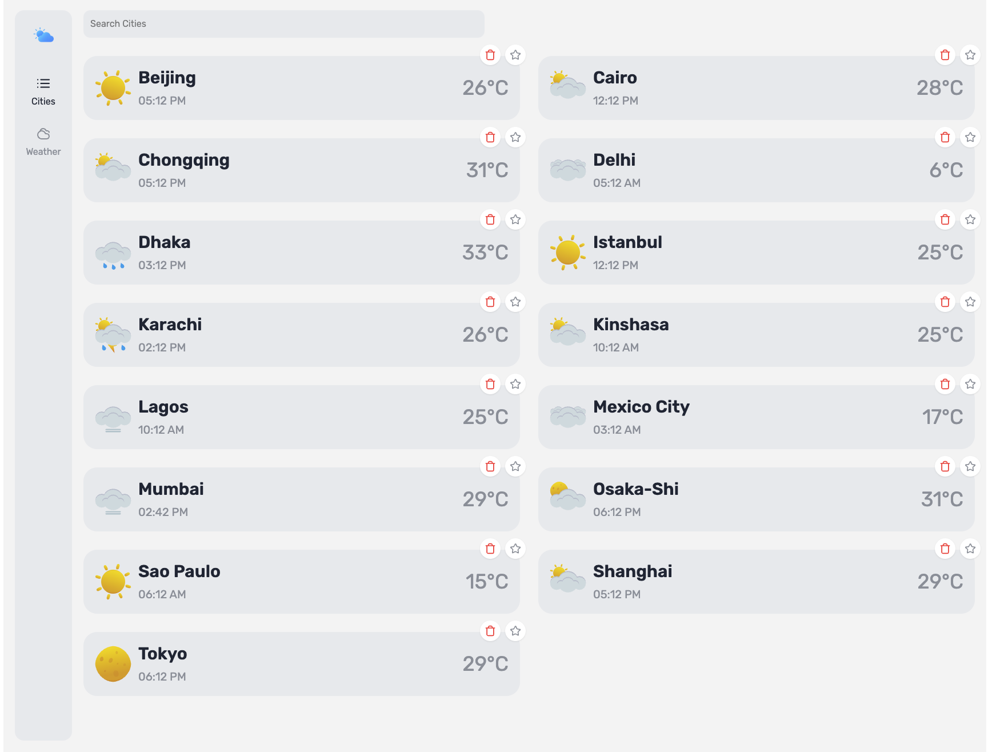
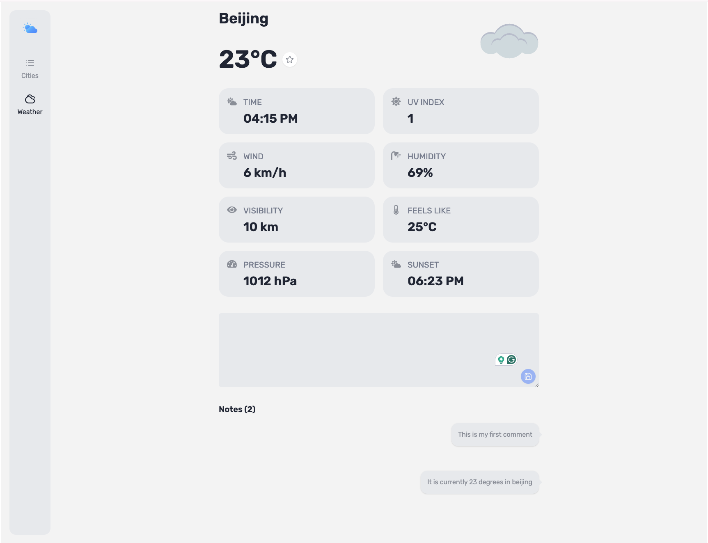
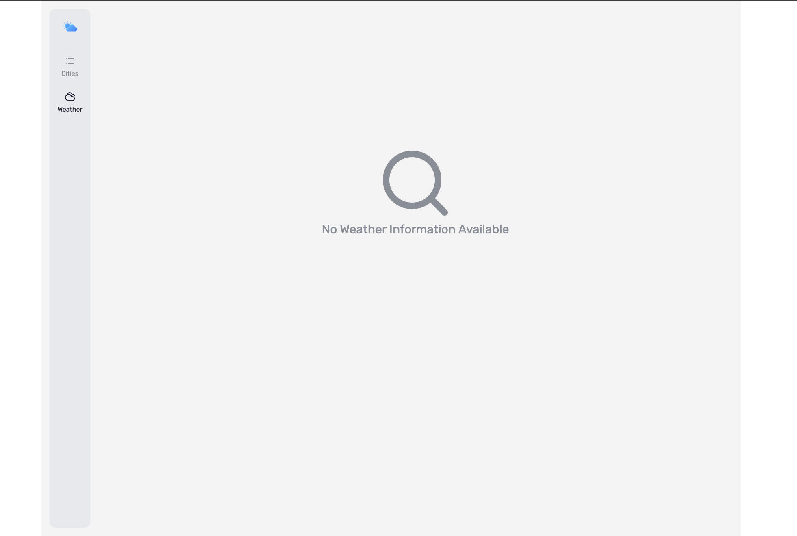
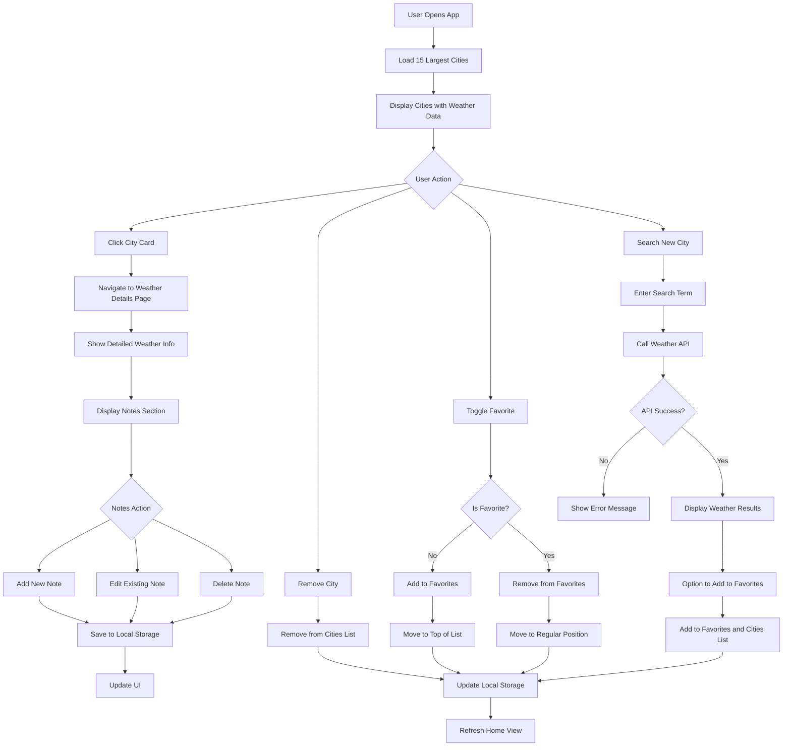
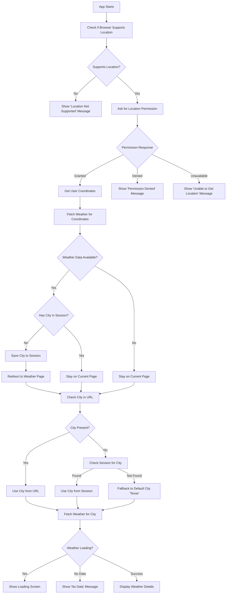

<p align="center">
  
</p>

# Zephyr - Weather Information Application

A modern, production-ready React application for looking up current weather information for cities worldwide with favorites management, offline functionality, and comprehensive user experience features.

## 🌟 Features

- **Real-time Weather Data**: Integration with weatherstack.com API for accurate weather information
- **Default City List**: Displays 15 largest cities worldwide by population in alphabetical order
- **City Search**: Look up weather details for any city worldwide
- **Favorites System**: Add/remove cities as favorites with priority display ordering
- **Detailed Weather View**: Comprehensive weather information with notes functionality
- **Notes Management**: Create, edit, and remove personal notes for each city
- **Offline Functionality**: Cached data persistence using local storage for offline access
- **Location Services**: Automatic user location detection with permission handling
- **Responsive Design**: Mobile-first design optimized for all screen sizes
- **Production-Ready**: Clean, modern aesthetic with attention to detail

<div class="page-break"></div>

## 📸 Screenshots

### Home Page with Default Cities



<div class="page-break"></div>

### City Weather Details


<div class="page-break"></div>

### Notes Management



<div class="page-break"></div>

### City Weather Information Not FOund



<div class="page-break"></div>

## 🚀 Quick Start

### Prerequisites

- Node.js 18+ and npm
- Weatherstack API key (get free at weatherstack.com)

### Installation

```bash
# Clone or extract the project
cd zephyr

# Install dependencies
npm install

# Set up environment variables
cp .env.example .env
# Add your weatherstack API key to .env

# Start development server
npm run dev
```

Visit [this url](https://zephyr-dusky.vercel.app/) to access the application.

### Environment Setup

Create a `.env` file with your weatherstack API key:

```env
VITE_WEATHERSTACK_API_KEY=your_api_key_here
VITE_WEATHER_API_URL=https://api.weatherstack.com
```

<div class="page-break"></div>

## 🏗️ Architecture

### Tech Stack

- **Framework**: React 18 with Vite
- **Language**: TypeScript (strict mode)
- **Styling**: Tailwind CSS (custom design, no UI frameworks)
- **State Management**: Zustand
- **Data Fetching**: TanStack React Query with custom caching
- **Routing**: React Router DOM
- **Testing**: Vitest + React Testing Library
- **Build Tool**: Vite with optimized production builds

<div class="page-break"></div>

## Project Structure

```
zephyr/
├── src/
│   ├── components/
│   │   ├── Cities/              # City listing & management
│   │   ├── SearchBar/           # City search functionality
│   │   ├── WeatherCard/         # Individual city weather display
│   │   ├── WeatherHero/         # Main weather display
│   │   ├── NotesSection/        # Notes management system
│   │   ├── ToastContainer/      # Toast notifications
│   │   └── [others]/
│   ├── pages/
│   │   ├── HomePage/            # Main city listing page
│   │   └── WeatherPage/         # Detailed weather view
│   ├── api/
│   │   └── data-hooks/
│   │       └── weather/         # Weather API integration
│   ├── store/
│   │   ├── slices/
│   │   │   ├── citiesSlice.ts   # City management state
│   │   │   ├── favoritesSlice.ts # Favorites management
│   │   │   ├── notesSlice.ts    # Notes management
│   │   │   └── toastSlice.ts    # Toast notifications
│   │   └── store.ts
│   ├── hooks/
│   │   ├── useUserLocation.ts   # Geolocation services
│   │   └── helpers/
│   ├── utils/
│   │   ├── storage.ts           # Local storage utilities
│   │   └── constants.ts
│   └── types/
├── docs/                        # Documentation assets
└── public/                      # Static assets
```

<div class="page-break"></div>

## 🔧 Key Features Implementation

### Weather API Integration

- **Real-time Data**: weatherstack.com API integration for current weather
- **Caching Strategy**: Intelligent caching with 30-minute TTL
- **Error Handling**: Graceful fallback to cached data during network issues
- **Rate Limiting**: Optimized API calls to respect service limits

### Offline Functionality

- **Local Storage**: Comprehensive caching of weather data and user preferences
- **Cache Management**: Automatic cache invalidation and cleanup
- **Offline Detection**: Network status monitoring with user feedback
- **Data Persistence**: Favorites, notes, and city data persist across sessions

### Location Services

- **Geolocation API**: Browser-based location detection
- **Permission Handling**: Graceful permission request flow
- **Auto-redirect**: Automatic navigation to user's city weather page
- **Error Handling**: Comprehensive error states and user feedback

### Responsive Design

- **Mobile-first**: Optimized for mobile devices with progressive enhancement
- **Breakpoint Strategy**: Tailored layouts for mobile, tablet, and desktop
- **Touch Optimization**: Enhanced touch targets and gesture support
- **Performance**: Optimized images and efficient rendering

<div class="page-break"></div>

## 🎯 User Flows

### Default Experience Flow



<div class="page-break"></div>

### Location Permission Flow



<div class="page-break"></div>

## 🧪 Testing Strategy

```bash
# Run all tests
npm test

# Run tests in watch mode
npm run test:watch

# Run tests with coverage
npm run test:coverage

# Run specific test suites
npm test -- --grep "WeatherCard"
```

**Comprehensive Test Coverage**:

- **Unit Tests**: All components with isolated testing
- **Integration Tests**: API hooks and data flow testing
- **User Interaction Tests**: Complete user journey testing
- **Edge Cases**: Error states, offline scenarios, and boundary conditions
- **Snapshot Testing**: UI consistency and regression prevention

### Test Statistics

- **Test Files**: 44 test files
- **Total Tests**: 214 test cases
- **Coverage**: >90% code coverage across all modules
- **Test Types**: Unit, integration, and user interaction tests

<div class="page-break"></div>

## 🚦 Available Scripts

```bash
npm run dev          # Start development server
npm run build        # Build for production
npm run preview      # Preview production build
npm run lint         # Run ESLint
npm run lint:fix     # Fix ESLint issues
npm test             # Run test suite
npm run test:watch   # Run tests in watch mode
```

## 🔒 Security & Performance Features

### Security

- **API Key Protection**: Environment variable management
- **Input Sanitization**: XSS prevention and input validation
- **Error Boundaries**: Graceful error handling and recovery
- **Content Security**: Safe HTML rendering and data handling

### Performance

- **Code Splitting**: Route-based lazy loading
- **Image Optimization**: Responsive images with lazy loading
- **Bundle Optimization**: Tree shaking and minification
- **Caching Strategy**: Intelligent data caching and storage management
- **Memory Management**: Efficient state management and cleanup

<div class="page-break"></div>

## 🎨 Design & UX Features

### Design System

- **Custom Design**: No UI frameworks - fully custom implementation
- **Consistent Theming**: Unified color palette and typography
- **Modern Aesthetic**: Clean, professional interface design
- **Accessibility**: WCAG compliant design patterns

### User Experience

- **Loading States**: Skeleton screens and progress indicators
- **Error Handling**: User-friendly error messages and recovery options
- **Toast Notifications**: Non-intrusive feedback system
- **Micro-interactions**: Smooth transitions and responsive feedback

### Responsive Behavior

- **Mobile Optimization**: Touch-friendly interface design
- **Adaptive Layouts**: Content reflow for different screen sizes
- **Progressive Enhancement**: Core functionality works across all devices

<div class="page-break"></div>

## 📊 Performance Metrics

### Build Optimization

- **Bundle Size**: Optimized for fast loading
- **Tree Shaking**: Unused code elimination
- **Code Splitting**: Efficient resource loading
- **Asset Optimization**: Compressed images and optimized fonts

### Runtime Performance

- **React Query**: Efficient data fetching and caching
- **Zustand**: Lightweight state management
- **Virtual DOM**: Optimized rendering performance
- **Memory Usage**: Efficient component lifecycle management

## 🌍 Browser Support

- **Chrome**: Latest 2 versions
- **Firefox**: Latest 2 versions
- **Safari**: Latest 2 versions
- **Edge**: Latest 2 versions
- **Mobile Browsers**: iOS Safari, Chrome Mobile

<div class="page-break"></div>

## 🤝 Development Guidelines

### Code Quality Standards

- **TypeScript**: Strict mode with comprehensive type safety
- **ESLint**: Enforced code style and best practices
- **Prettier**: Automated code formatting
- **Import Organization**: Consistent import ordering and grouping

### Component Architecture

- **Single Responsibility**: One component per file with clear purpose
- **Type Safety**: Comprehensive TypeScript interfaces and props
- **Testing**: Co-located test files with full coverage
- **Documentation**: Clear component APIs and usage examples

### State Management Patterns

- **Zustand Slices**: Domain-separated state management
- **Immutable Updates**: Safe state mutations
- **Selector Optimization**: Preventing unnecessary re-renders
- **Persistence**: Automatic local storage integration

<div class="page-break"></div>

## 🔧 Configuration Files

### Environment Variables

```env
# Required
VITE_WEATHERSTACK_API_KEY=your_api_key_here
VITE_API_BASE_URL=http://api.weatherstack.com
```

### Build Configuration

- **Vite**: Modern build tool with hot module replacement
- **TypeScript**: Strict configuration for type safety
- **Tailwind**: Custom configuration with design system tokens
- **Vitest**: Test configuration with jsdom environment

## 📈 Future Enhancements

### Potential Improvements

- **Weather Forecasts**: Extended weather predictions
- **Weather Maps**: Interactive weather visualization
- **Push Notifications**: Weather alerts and updates
- **Social Features**: Share weather information
- **Themes**: Dark/light mode support
- **Internationalization**: Multi-language support

<div class="page-break"></div>

## 📋 Assignment Requirements Compliance

### ✅ Core Requirements Met

- **Real-time Weather API**: weatherstack.com integration
- **15 Largest Cities**: Default display with population-based ordering
- **Individual Removal**: Cities can be removed from default list
- **Detailed Weather View**: Comprehensive weather information page
- **Notes System**: Create, edit, and remove notes for cities
- **Search Functionality**: Global city weather lookup
- **Favorites Management**: Add/remove favorites with priority display
- **Offline Functionality**: Local storage caching and offline access
- **Location Services**: Automatic user location detection
- **Component Architecture**: Well-defined, reusable components
- **Unit Testing**: Comprehensive test coverage
- **Production-Ready Design**: Modern, clean aesthetic without UI frameworks

### 🔧 Technical Excellence

- **TypeScript**: Full type safety and strict mode compliance
- **Performance**: Optimized loading and runtime performance
- **Error Handling**: Graceful error states and recovery
- **Code Quality**: ESLint, Prettier, and best practices
- **Testing**: 214 tests across 44 test files with >90% coverage

<div class="page-break"></div>

## 📄 License

This project is built as a technical assessment for Elite Software Automation and is not intended for commercial use.

**Assignment Version: SDEB-2025-02-i**
**Built with ❤️ using React, TypeScript, and modern web technologies**

---
